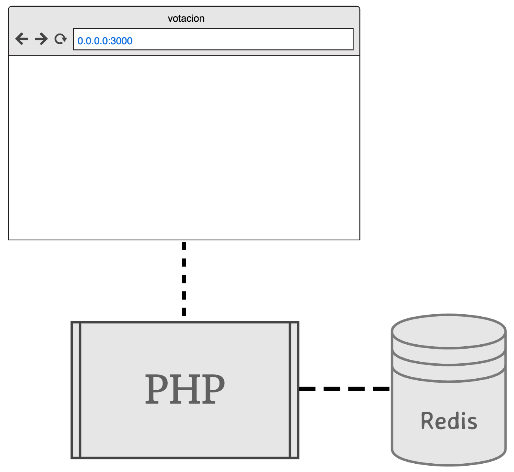

# Votación: Aplicación simple en PHP con Docker y docker-compose

## Cómo empezar
Descarga [Docker para Mac o Windows](https://www.docker.com/). Si tienes una versión de Windows antigua, puedes usar [Docker Toolbox](https://www.docker.com/products/docker-toolbox).

Clona la aplicación y corre dentro del directorio:

	$ docker-compose up

La aplicación correrá en [http://localhost:3000/](http://localhost:3000)

## Arquitectura

* Una aplicación PHP 7 que te permite votar por Aurora o Wilstermann.
* Una base de datos Redis que guarda los votos por ambos participantes.
